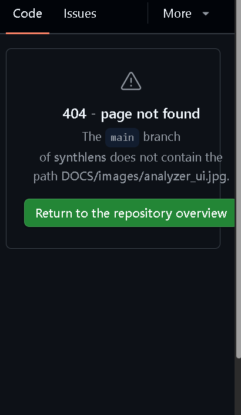

# 🎹 SynthLens - The Ultimate AI Synthesizer Analyzer


**SynthLens** is a revolutionary AI-powered synthesizer analyzer designed for Android. Whether you're trying to recreate a classic sound, learn sound design, or document your hardware synth patches, SynthLens acts as your intelligent assistant. It listens to audio input and instantly identifies synthesizers, meticulously analyzing their oscillators, filters, modulation, and patch settings in real-time.

---

## 📸 Screenshots & UI

Here's a glimpse into the sleek, dark-themed, and modern aesthetic of SynthLens:

<p align="center">
  
  
</p>

*Left: The real-time Analyzer displaying waveform, spectrum, and detected parameters. Right: The organized Patch Database keeping track of your favorite sounds.*

---

## ✨ Key Features

- 🎧 **Real-time Audio Analysis:** Instantly analyze audio from your device's microphone, system input, or connected audio interfaces.
- 🤖 **AI-Powered Synth Detection:** Employs advanced on-device Machine Learning (TensorFlow Lite) to identify synthesizer models with incredibly high confidence.
- 🎛️ **Deep Parameter Extraction:** Automatically detects precise parameters:
  - **Oscillators:** Waveforms (Sine, Square, Sawtooth, Triangle), pulse width, and tuning.
  - **Filters:** Cutoff frequency, resonance, and slope (12dB/24dB).
  - **Envelopes & LFOs:** Attack, Decay, Sustain, Release times and modulation rates.
- 💾 **Comprehensive Patch Database:** Save, categorize, and recall analyzed patches. Tag them by genre, synth model, or vibe.
- 📊 **Pro-Grade Spectrum Analyzer:** Visual frequency analysis with logarithmic scaling, real-time waveform monitoring, and peak detection.
- 🎛️ **DAW & Hardware Integration:** Export patches to popular DAWs or send MIDI/OSC messages to compatible hardware.
- 🌙 **Modern Aesthetic:** A gorgeous dark-theme UI designed to look like a modern synth rack, built entirely with Jetpack Compose.

---

## 🚀 Getting Started

### Installation

#### From Source

```bash
# Clone the repository
git clone https://github.com/dixi3stdgdl-design/synthlens.git

# Open the project in Android Studio (Hedgehog or newer)
# Sync Gradle and build the project
```

#### Download APK

Download the latest compiled APK directly from our [Releases](https://github.com/dixi3stdgdl-design/synthlens/releases) page.

### System Requirements

- **OS:** Android 8.0+ (API level 26 or higher)
- **Permissions:** Microphone access is required for real-time audio input.
- **Hardware:** 2GB+ RAM recommended for smooth AI inference and UI rendering.

---

## 🏗️ Architecture & Tech Stack

Built with modern Android development practices to ensure performance and maintainability:

- **Language:** Kotlin 1.9+
- **UI Framework:** Jetpack Compose (Modern declarative UI) + Material Design 3
- **Audio Processing:** Android AudioRecord API & custom C++ FFT algorithms via JNI
- **Machine Learning:** TensorFlow Lite for on-device, low-latency inference
- **Architecture Pattern:** MVVM (Model-View-ViewModel) with Clean Architecture principles
- **Asynchronous Operations:** Kotlin Coroutines & Flow

---

## 🛠️ Development & Building

### Prerequisites

- Android Studio Hedgehog (2023.1.1) or newer
- JDK 17
- Android SDK 34

### Build Commands

```bash
# Build a debug APK
./gradlew assembleDebug

# Run unit and integration tests
./gradlew test
```

---

## 🤝 Contributing

We welcome contributions from the community! If you're passionate about synths and code, we'd love your help.

1. Fork the repository
2. Create your feature branch (`git checkout -b feature/amazing-new-feature`)
3. Commit your changes (`git commit -m 'Add some amazing new feature'`)
4. Push to the branch (`git push origin feature/amazing-new-feature`)
5. Open a Pull Request and describe your changes.

---

## 📄 License

This project is open-source and licensed under the MIT License - see the [LICENSE](LICENSE) file for details.

---

## 🙏 Acknowledgments

- The incredible Android Audio API documentation.
- Researchers in the field of synthesizer parameter analysis.
- The open-source community for providing excellent audio processing and ML libraries.

---

<p align="center">
  <b>Built with ❤️ by Dixi3 Lqbs With MiMo Team</b><br>
  <a href="https://github.com/dixi3stdgdl-design">GitHub Profile</a>
</p>


